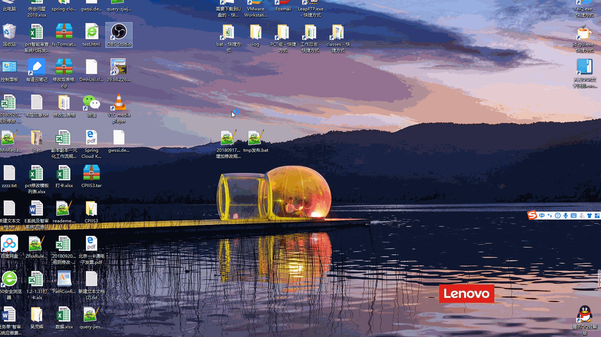

### 搭建直播服务器
### 直播的使用过程
1. [下载OBS推流软件](https://cdn-fastly.obsproject.com/downloads/OBS-Studio-23.1-Full-Installer-x64.exe)   
   [下载Lvs观看直播软件](https://mirrors.tuna.tsinghua.edu.cn/videolan-ftp/vlc/3.0.6/win32/vlc-3.0.6-win32.exe)

2. 利用OBS推流,开启直播
   - 直播地址: rtmp://www.wulinghui.store:1935/stream
   - 密匙: hello
   - 具体的设置   
   
   
3. 利用LSC查看直播   
   - 直播地址: rtmp://www.wulinghui.store:1935/stream/hello
   - 具体的设置   
   